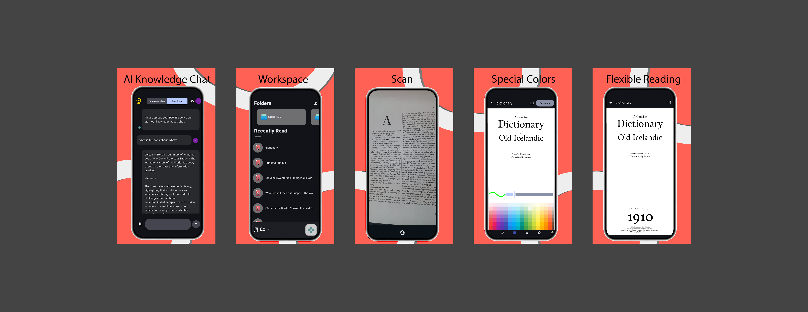

  <!-- Logo and Title Align Horizontally -->
  <table border="0" cellpadding="0" cellspacing="0" style="border-collapse: collapse; border: none; margin: auto;">
    <tr style="border: none;">
      <td style="border: none; padding-right: 15px; vertical-align: middle;">
        
      </td>
      <td style="border: none; vertical-align: middle;">
        <h1 style="margin: 0; padding: 0; font-size: 2.5em; border-bottom: none; line-height: 1.2;">Docify: AI PDF & Knowledge Chat</h1>
      </td>
    </tr>
  </table>

   

  
<strong>Docify</strong> is a next-generation productivity ecosystem that goes beyond managing your documents—it allows you to "converse" with them, powered entirely by on-device AI and high-performance native engines.

   

  <!-- CRITICAL PROJECT STATUS BANNER -->
  > [!WARNING]
> ### UNDER ACTIVE ARCHITECTURAL REFACTORING
> **Attention Workspace Reviewers:** The project is currently undergoing a massive structural overhaul to transition from a monolithic app into a decoupled micro-client ecosystem. During this active development phase, certain live cloud endpoints and chat sub-systems are deliberately restricted or undergoing migration.
> 
> **Current Engineering Focus:**
> * **Service Decoupling:** Splitting the repository into two highly specialized independent modules:
> * **Source Academic Client:** Dedicated to local LLM inference, vector embedding management, and semantic intelligence.
> * **Source Viewer Client:** Dedicated to low-level native PDF rendering, drawing buffers, and C++/JNI layers.
> * **Rebranding & Namespace Migration:** Progressively refactoring packages to decouple dependency graphs and establish cleaner dependency injection boundaries.

---

## 🧠 On-Device AI: Gemma & Privacy-First

Docify prioritizes user data privacy and data sovereignty by running deep learning models locally on the client's device, completely eliminating cloud leakage vectors.

*   **Model Architecture:** `gemma3_1b_it_int4.task` handled via the MediaPipe LLM Inference engine.
*   **Zero-Knowledge Privacy:** Contextual retrieval, text summarization, and vector querying are computed locally. Private user documents are never transmitted to external clouds or foreign APIs.
*   **Dynamic Asset Delivery:** To drastically minimize initial APK download sizes, the resource-heavy AI model is streamed in the background post-installation utilizing **Android Play Asset Delivery (Fast-Follow)** mechanics.

---

## 🛠️ Technical Engineering (Native & JNI Interop)

The true performance backbone of Docify lies in its hybrid combination of low-level native compilation and contemporary reactive Android components.

### 📄 Native PDF Engine (Pdfium & JNI Layer)
Instead of relying on heavy high-level web view hacks, Docify embeds Google’s open-source C++ **Pdfium** engine directly into the Android binaries.
*   **JNI Interoperability:** C++ drawing buffers and document parsers are tightly bound to Kotlin structures via the **Java Native Interface (JNI)** at the native `libs/obj` tier.
*   **Custom Annotation Pipeline:** Engineered a native drawing canvas that allows users to perform real-time, zero-lag free-hand annotation, text highlighting, and object layering over raw PDF sheets.
*   **Memory Footprint Optimization:** Native pointers and object references are closely monitored and automatically recycled via structured memory lifecycle hooks to prevent memory leaks and out-of-memory (OOM) faults on large documents.

### 🏗️ Software Architecture Patterns
*   **Advanced Modularization:** The functional domains are systematically split. AI inference blocks have zero visibility into rendering engines, avoiding tight coupling.
*   **Clean Architecture & MVVM/MVI:** Adheres strictly to Separation of Concerns. Business logic communicates with presentation layers through unalterable reactive state flows, streamlining unit test configurations.

---

## ✨ Core Product Capabilities

*   **💬 AI Knowledge Chat:** Perform semantic real-time Q&A workflows over loaded PDF contents with full local context retention.
*   **📝 Smart Summarization:** Condense lengthy academic literature, complex legal contracts, or tech reports into concise analytical points within seconds.
*   **🎨 Advanced PDF Editor:** Embedded tools for direct **free-hand sketching**, **vector highlighting**, and custom layer notes.
*   **📂 Structured PDF Toolkit:**
    *   *Instantiation:* Create digital PDF files on-the-fly from unstructured text payloads or images.
    *   *File Mutation:* Seamlessly merge multi-file structures or split document packages.
    *   *Workspace Management:* Create hierarchical directories for complex workflow isolation.
*   **📷 Document Scanner:** High-precision digitization utility designed to convert physical documents into formatted PDFs using local OCR capture layers.

---

## 🚀 Enterprise Tech Stack

| Operational Layer | Technologies Utilized |
| :--- | :--- |
| **LLM Inference Engine** | **Google Gemma** (via MediaPipe Core Tasks) |
| **Native Render Pipeline** | **Pdfium Core** (C++ Binary / JNI Interop Layer) |
| **Modern UI Framework** | **Jetpack Compose** & Google Material Design 3 |
| **Dependency Injection** | **Dagger Hilt** (Scoped Component Trees) |
| **Cloud Synchronization** | **Firebase Ecosystem** (Auth, Firestore, Cloud Storage) |
| **Asset Delivery Subsystem** | **Play Asset Delivery** (Dynamic Fast-Follow Splitting) |

---

## 📈 Quality Assurance & Telemetry

*   **Native & Kotlin Crash Analytics:** Firebase Crashlytics integrations rigged to catch and log exceptions gracefully across both the managed Kotlin runtime and unmanaged C++ JNI layers.
*   **Performance Metrics:** Anonymous Firebase Analytics triggers designed to capture local inference benchmarks and render execution latency metrics.

---

## 🚀 Strategic Roadmap & Planned Engineering Refactoring

To guarantee the long-term maintainability and micro-service compatibility of the ecosystem, the following roadmap is actively executed:

- [🔄] **Micro-Client Decoupling:** Complete the total segregation of **Source Academic** (Inference) and **Source Viewer** (JNI Rendering) into isolated workspace structures.
- [ ] **Feature-Based Architecture:** Move from technical package layer groups towards modularized feature modules to enhance parallel compilation performance.
- [ ] **Hybrid Cloud Fallback:** Integrate an optional secure **RESTful API** gate to delegate complex long-context reasoning to remote cloud instances when local hardware limitations are reached.
- [ ] **JNI Bridge Automation Testing:** Write robust automated integration tests (JUnit / Espresso) to intensively validate JNI pointer states and memory allocations.

---

## 🌍 Live Metrics & Production Status

*   **Production Deployment:** Fully launched and operational on the **Google Play Store**.
*   **Infrastructure Model:** 100% Client-Side / Zero API or Server Maintenance Overhead.
*   **Data Strategy:** Offline-First / Local Security Priority.

---

<!-- VISUAL FOOTER: APP PREVIEW & STORE LINKS -->

   
  <h3>📱 Application Preview & Production Link</h3>
   

  <!-- App Screenshots -->
  

    

  <!-- Google Play Badge -->
  
  
   

